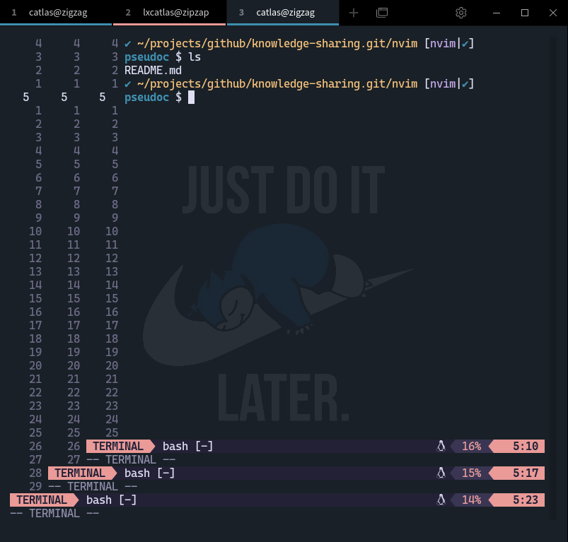

# Neovim and useful Vim motions

In 1976 Bill Joy created vi, and in 1991 Bram Moolenaar released Vim as a
improved version of vi.

Then in 2014, NeoVim came along. Neovim is higly refactored fork of Vim,
which focuses on extensibility and usability. Neovim is a drop-in replacement
of Vim.

## Neovim vs Vim

### Contributors

[Vim](https://github.com/vim/vim/graphs/contributors)

For Vim, Bram is the one who can decide go or no-go on a feature or something,
he has the total control over the repository. If someone else has the roadmap
or pull-requrest submission that does not align with Bram's thought, and then
it will simply not going to happen.

[Neovim](https://github.com/neovim/neovim/graphs/contributors)

So Neovim first came out because of people are fed up with Bram's leadership,
and his unchallengable authority over the project.

### Features

There are some features that are firstly shipped in Neovim then Vim ended up
adding those features as well.

1. Terminal

    You can use `:terminal` to launch a terminal inside Vim/Neovim. And you may
    find yourself falled into this recursive hell.

    

1. Asynchronous action.

    This is more usfully in plugin developemnt, so the codes can be executed in
    the background instead of blocking the current UI frame.

The biggest difference bewteen Neovim and Vim now is Neovim has a built-in
[LSP](https://microsoft.github.io/language-server-protocol/) support, and Lua
support.

1. LSP (Language Server Protocol)

    The provide the API features like auto-complete, go to definition, find all
    references.

1. Lua

    IMO, I think the built-in Lua support is the feature that starts to change
    everything. Some of you may use Vimscript to customize your Vim by editing
    the `.vimrc` file. Vimscript is not capable of being a programming language.
    You may find it really hard to find an answer for a Vimscript question.
    
    Then many great plugins came along for Neovim only, as they are written in Lua.

## Neovim Plugins

You can find Neovim plugins here: [neovimcraft](https://neovimcraft.com/).

We will be focusing on the following plugins:

- [nvim-treesitter](https://github.com/nvim-treesitter/nvim-treesitter)
    The nvim-treesitter will provide you better syntax highlighting, better indention support.

- [telescope.nvim](https://github.com/nvim-telescope/telescope.nvim)
    Real cool fuzzy-finder for quick navigation.
    
- [packer.nvim](https://github.com/wbthomason/packer.nvim)
    Plugin manager that can also manage itself, easy to use and apply customizations on plugins.

## Vim motions and tricks

There are a lot of ways you can do certain things in Vim, memorizing everything is not
practical, I found these quite useful.

1. Basic Vim motions
1. Advanced Vim motions (`:help text-objects`)
1. Very useful keybindings
